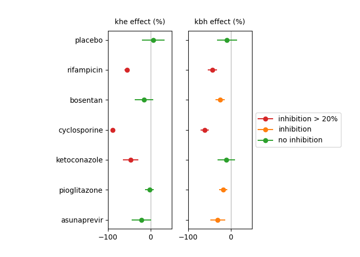

---

## Measuring drug-mediated inhibition of liver transporters: analysis of TRISTAN rat data

[](https://www.apache.org/licenses/LICENSE-2.0) [](https://creativecommons.org/licenses/by/4.0/) [](https://zenodo.org/records/15610350)


## 📚 Context 

The liver is responsible for filtering waste products from the blood, and evacuating these by excreting them to bile. Drugs commonly affect these procesesses, potentially leading to toxic side effects.

If a drug inhibits excretion into the bile, then harmful material can get stuck in liver cells and cause damage to the liver. This is commonly referred to as drug-induced liver injury (DILI). If a drug on the other hand blocks the uptake of these materials into the liver, they will circulate in the blood for too long and may cause harm elsewehere.

When dealing with novel drugs, either in basic research or drug development, it is often unknown to what extent a drug affects the uptake or excretion into the liver. This can expose trial participants to significant risk, or even patients in clinical practice if the risk is not identified during development.

In order to mitigate these risks, the [TRISTAN project](https://www.imi-tristan.eu/) developed an MRI-based method to measure the effect of drugs in liver transporters directly. An [analysis pipeline](https://zenodo.org/records/15512551) was developed which generates measurements from signal-time curves in liver and aorta. 

The pipeline in this repository derives some key results from previous studies in rats published by the TRISTAN consortium. The analysis was done post-hoc as an illustration and replication excercise with new code, but does not aim to replicate the exact figures and tables from the manuscript.

## 🛠️ Methodology 

The **inputs** to the pipeline are metrics produced by the assay for primary and secondary objectives, saved in a [persistent data archive](https://zenodo.org/records/15610350).

The **output** is the a number of figures summarising key findings from the rat studies.

## 💻 Usage

The pipeline can be run after installing the requirements:

```console
pip install -r requirements.txt
```

The folder **build** contains the output of the analysis. To reproduce it, delete the **build** folder and run the script **src/run.py**. This takes less than a minute on a standard laptop computer and should recreate all results in the **build** folder.


## 	📄 Code structure

The **src** folder contains all the source code, with the top level entry scripts **run.py**. This call functions in the subfolder **stages**.

The **build** folder contains the output of the top level scripts. It can be deleted and will be fully rebuilt when running the script. The **build** folder has the following contents: 

- **Data**: contains the downloaded data.
- **Tables**: tables and numerical results produced by **src/methods/analysis.py**.
- **Figs**: Figures produced by **src/methods/plot.py**.


## ❤️ Citation 


Thazin Min, Marta Tibiletti, Paul Hockings, Aleksandra Galetin, Ebony Gunwhy, Gerry Kenna, Nicola Melillo, Geoff JM Parker, Gunnar Schuetz, Daniel Scotcher, John Waterton, Ian Rowe, and Steven Sourbron. Measurement of liver function with dynamic gadoxetate-enhanced MRI: a validation study in healthy volunteers. [Proc Intl Soc Mag Reson Med, Singapore 2024, 4015](https://archive.ismrm.org/2024/4015.html).

## 💰 Funding 

The work was performed as part of the [TRISTAN project](https://www.imi-tristan.eu/) on imaging biomarkers for drug toxicity. The project was EU-funded through the [Innovative Health Initiative](https://www.ihi.europa.eu/).

[](https://www.imi-tristan.eu/)

## 👥 Contributors

<!-- ALL-CONTRIBUTORS-LIST:START - Do not remove or modify this section -->
<!-- prettier-ignore-start -->
<!-- markdownlint-disable -->
<table>
  <tbody>
    <tr>
      <td align="center" valign="top" width="14.28%"><a href="https://github.com/EbonyGunwhy"><br /><sub><b>Ebony Gunwhy</b></sub></a><br /></td>
      <td align="center" valign="top" width="14.28%"><a href="https://github.com/plaresmedima"><br /><sub><b>Steven Sourbron</b></sub></a><br /></td>
    </tr>
  </tbody>
</table>
